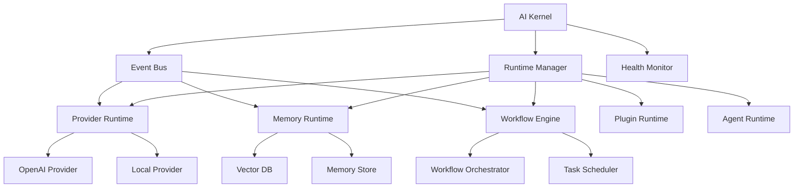

# 🧠 TangkuAgentOS

> **An open-source AI Operating System for building, managing, and orchestrating intelligent agents, workflows, memory systems, and AI runtimes.**

---

## 🌌 Vision

TangkuAgentOS aims to become a **modular AI Operating System** where multiple AI models, agents, tools, plugins, memories, and workflows operate together through a **unified AI Kernel**.

The goal is to create an **extensible platform** for developers to build the next generation of intelligent applications.

---

## ✨ Features

### 🏗️ Core Architecture
- 🧠 **AI Kernel** - Central coordination hub for all runtimes
- ⚙️ **Runtime Manager** - Manages the lifecycle of all runtimes
- 🔄 **Lifecycle Management** - Start, stop, pause, and resume runtimes
- 🩺 **Health Monitoring** - Tracks the health of all runtimes
- 📡 **Event Bus** - Facilitates event-driven communication
- 🔌 **Plugin Runtime** - Extensible plugin system
- 🛠 **Tool Registry** - Manages available tools and functions

### 🤖 AI Capabilities
- **Multi-provider AI support** (OpenAI, Local LLMs, etc.)
- **Agent ecosystem** for autonomous AI agents
- **Multi-agent collaboration** for complex tasks
- **Long-term memory** for persistent agent knowledge
- **Workflow automation** for multi-step processes
- **Agent learning systems** for continuous improvement
- **AI-powered development tools** for developers

### 💻 Developer Platform
- **CLI interface** for managing the system
- **API server** for programmatic access
- **Web dashboard** for monitoring and control
- **Developer SDK** for building custom runtimes
- **Agent marketplace** for sharing agents and plugins
- **Extension system** for adding new functionalities

---

## 🏗️ Architecture

TangkuAgentOS is designed around **modular runtimes**:



---

## 🚀 Quick Start

### 📥 Installation

1. **Clone the repository:**
   ```bash
   git clone https://github.com/Pitikha/TangkuAgentOS.git
   cd TangkuAgentOS
   ```

2. **Install dependencies:**
   ```bash
   pip install -e .
   ```

3. **(Optional) Set up environment variables:**
   ```bash
   cp .env.example .env
   # Edit .env with your API keys and settings
   ```

4. **(Optional) Configure TangkuAgentOS:**
   ```bash
   cp config.yaml.example config.yaml
   # Edit config.yaml with your settings
   ```

---

### 🏃 Running TangkuAgentOS

#### Option 1: Run as a Python Module
```bash
python -m tangku_agentos
```

#### Option 2: Use the CLI
```bash
# Start TangkuAgentOS
tangku-agentos start

# Check status
tangku-agentos status

# Stop TangkuAgentOS
tangku-agentos stop

# Check health
tangku-agentos health

# Show version
tangku-agentos version

# Show configuration
tangku-agentos config
```

#### Option 3: Run with Custom Configuration
```bash
tangku-agentos start --config /path/to/custom_config.yaml
```

---

## 📂 Project Structure

```
tangku_agentos/
├── __init__.py                 # Package initialization
├── __main__.py                 # Entry point for python -m tangku_agentos
├── cli/                        # Command-line interface
│   ├── __init__.py
│   └── cli.py                  # CLI commands
├── configuration/              # Configuration management
│   ├── __init__.py
│   ├── config_loader.py        # Configuration loader
│   └── manager.py              # Configuration manager
├── core_runtime/               # Core runtime components
│   ├── __init__.py
│   ├── event_bus.py            # Event bus for inter-runtime communication
│   ├── lifecycle_manager.py   # Runtime lifecycle management
│   ├── logger.py               # Logging system
│   ├── registry.py             # Runtime registry
│   ├── state_manager.py        # State management
│   └── types.py                # Type definitions
├── kernel_runtime/             # AI Kernel and runtime management
│   ├── __init__.py
│   ├── kernel.py               # Main KernelManager class
│   ├── bootstrap.py            # Kernel bootstrap
│   ├── dependency_manager.py   # Dependency management
│   ├── health.py               # Health monitoring
│   ├── lifecycle.py            # Lifecycle management
│   ├── recovery.py             # Recovery system
│   ├── resources/              # Resource management
│   ├── runtime_coordinator.py  # Runtime coordination
│   ├── runtime_loader.py       # Runtime loading
│   ├── runtime_registry.py     # Runtime registry
│   ├── runtime_supervisor.py   # Runtime supervision
│   ├── scheduler/              # Scheduling system
│   ├── state/                  # State management
│   └── types.py                # Type definitions
├── provider_runtime/           # AI Provider runtime
│   ├── __init__.py
│   ├── adapter.py              # Provider adapter
│   ├── benchmark.py            # Benchmarking tools
│   ├── cli.py                  # Provider CLI
│   ├── configuration.py        # Provider configuration
│   ├── constants.py            # Constants
│   ├── dashboard.py            # Provider dashboard
│   ├── exceptions.py           # Exceptions
│   ├── factory.py              # Provider factory
│   ├── health.py               # Health monitoring
│   ├── hub.py                  # Provider hub
│   ├── integration.py          # Integration tools
│   ├── interfaces.py           # Provider interfaces
│   ├── keys.py                 # API key management
│   ├── manager.py              # Provider manager
│   ├── providers.py            # Provider implementations
│   ├── registry.py             # Provider registry
│   ├── router.py               # Provider routing
│   ├── session.py              # Session management
│   ├── types.py                # Type definitions
│   └── wizard.py               # Setup wizard
├── memory_engine/              # Memory runtime
│   ├── __init__.py
│   ├── backend.py              # Memory backend
│   ├── cache.py                # Caching system
│   ├── compressor.py           # Memory compression
│   ├── configuration.py        # Memory configuration
│   ├── context.py              # Context management
│   ├── coordinator.py          # Memory coordination
│   ├── events.py               # Memory events
│   ├── exceptions.py           # Exceptions
│   ├── intelligence.py         # Intelligence layer
│   ├── interfaces.py           # Memory interfaces
│   ├── manager.py              # Memory manager
│   ├── metadata.py             # Metadata management
│   ├── models.py               # Data models
│   ├── optimizer.py            # Memory optimization
│   ├── provider.py             # Memory provider
│   ├── registry.py             # Memory registry
│   ├── repository.py           # Memory repository
│   ├── resolver.py             # Memory resolution
│   ├── router.py               # Memory routing
│   ├── serializer.py           # Serialization
│   ├── statistics.py           # Statistics
│   ├── store.py                # Memory store
│   └── version_manager.py      # Version management
├── workflow_engine/            # Workflow runtime
│   ├── __init__.py
│   ├── context.py              # Workflow context
│   ├── events.py               # Workflow events
│   ├── exceptions.py           # Exceptions
│   ├── executor.py             # Workflow executor
│   ├── history.py              # Workflow history
│   ├── interfaces.py           # Workflow interfaces
│   ├── lifecycle.py            # Workflow lifecycle
│   ├── manager.py              # Workflow manager
│   ├── models.py               # Workflow models
│   ├── orchestration.py        # Workflow orchestration
│   ├── queue.py                # Workflow queue
│   ├── registry.py             # Workflow registry
│   ├── scheduler.py            # Workflow scheduler
│   └── state.py                # Workflow state
├── examples/                   # Example scripts
│   ├── __init__.py
│   ├── basic_usage.py          # Basic usage example
│   └── simple_workflow.py      # Simple workflow example
├── tests/                      # Test suite
│   ├── __init__.py
│   ├── test_integration.py     # Integration tests
│   └── test_kernel.py          # Kernel tests
├── .env.example                # Environment variables template
├── .gitignore                 # Git ignore rules
├── config.yaml                # Default configuration
├── pyproject.toml             # Project configuration
└── README.md                  # This file
```

---

## 🛠️ Usage Examples

### Basic Usage

```python
from tangku_agentos.kernel_runtime.kernel import KernelManager

# Create and initialize the kernel
kernel = KernelManager()
kernel.initialize()

# Start the kernel
kernel.startup()

# Check status
status = kernel.status()
print(f"Kernel State: {status['state']}")

# Shutdown the kernel
kernel.shutdown()
```

### Using the CLI

```bash
# Start TangkuAgentOS
tangku-agentos start

# Check status
tangku-agentos status

# Stop TangkuAgentOS
tangku-agentos stop
```

### Running Examples

```bash
# Run the basic usage example
python -m examples.basic_usage

# Run the simple workflow example
python -m examples.simple_workflow
```

---

## 🔧 Configuration

TangkuAgentOS uses a **YAML-based configuration system** with support for **environment variables**.

### Configuration File (`config.yaml`)

```yaml
# Kernel Configuration
kernel:
  name: "TangkuAgentOS"
  version: "1.0.0b2"
  debug: false
  log_level: "INFO"

# Provider Runtime Configuration
providers:
  openai:
    enabled: true
    api_key: "${OPENAI_API_KEY}"  # Set via environment variable
    base_url: "https://api.openai.com/v1"
    default_model: "gpt-3.5-turbo"
    timeout: 30
    max_retries: 3

  local:
    enabled: false
    model_path: "/path/to/local/model"
    backend: "llama"

# Memory Engine Configuration
memory:
  enabled: true
  backend: "vector"
  vector_db:
    type: "faiss"
    index_path: "./data/memory_index"
    dimension: 768

# Workflow Engine Configuration
workflow:
  enabled: true
  max_concurrent_workflows: 10
  default_timeout: 300
  retry_on_failure: true

# Runtime Configuration
runtimes:
  - name: "provider_runtime"
    enabled: true
    dependencies: []
  - name: "memory_engine"
    enabled: true
    dependencies: []
  - name: "workflow_engine"
    enabled: true
    dependencies: ["provider_runtime", "memory_engine"]
```

### Environment Variables (`.env`)

```bash
# OpenAI API Key
OPENAI_API_KEY=your_api_key_here

# Local Model Path
LOCAL_MODEL_PATH=/path/to/your/local/model

# Log Level
LOG_LEVEL=INFO

# Debug Mode
DEBUG=false
```

---

## 🤝 Contributing

We welcome contributions! Please see our [Contributing Guide](CONTRIBUTING.md) for details.

### Development Setup

1. Fork the repository
2. Create a feature branch (`git checkout -b feature/your-feature`)
3. Commit your changes (`git commit -am 'Add some feature'`)
4. Push to the branch (`git push origin feature/your-feature`)
5. Open a Pull Request

### Running Tests

```bash
# Install development dependencies
pip install -e .[development]

# Run tests
pytest tests/ -v
```

---

## 📜 License

This project is licensed under the **MIT License** - see the [LICENSE](LICENSE) file for details.

---

## 🙏 Acknowledgments

- Inspired by the growing need for **modular AI systems**
- Built with **Python** and **asyncio** for high performance
- Designed for **extensibility** and **developer-friendly** usage

---

## 📞 Contact

- **Repository**: [Pitikha/TangkuAgentOS](https://github.com/Pitikha/TangkuAgentOS)
- **Issues**: [GitHub Issues](https://github.com/Pitikha/TangkuAgentOS/issues)
- **Discussions**: [GitHub Discussions](https://github.com/Pitikha/TangkuAgentOS/discussions)

---

**Star this repository if you find it useful! ⭐**

*TangkuAgentOS - The AI Operating System for the Next Generation of Intelligent Applications*
