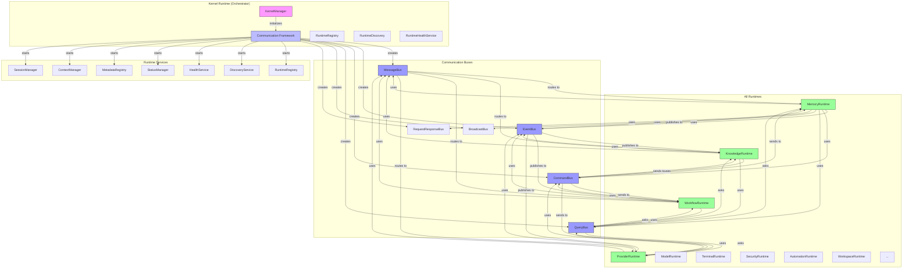
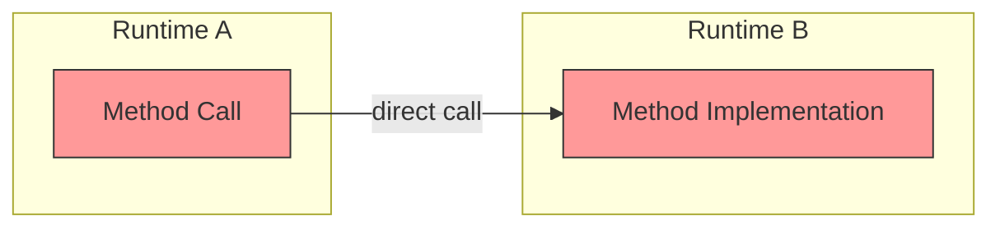
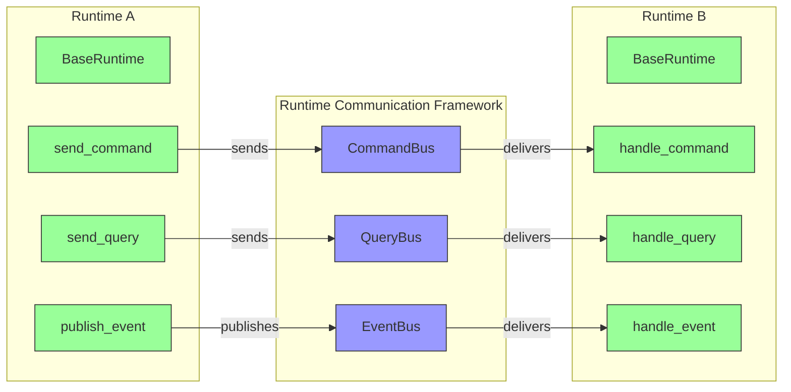
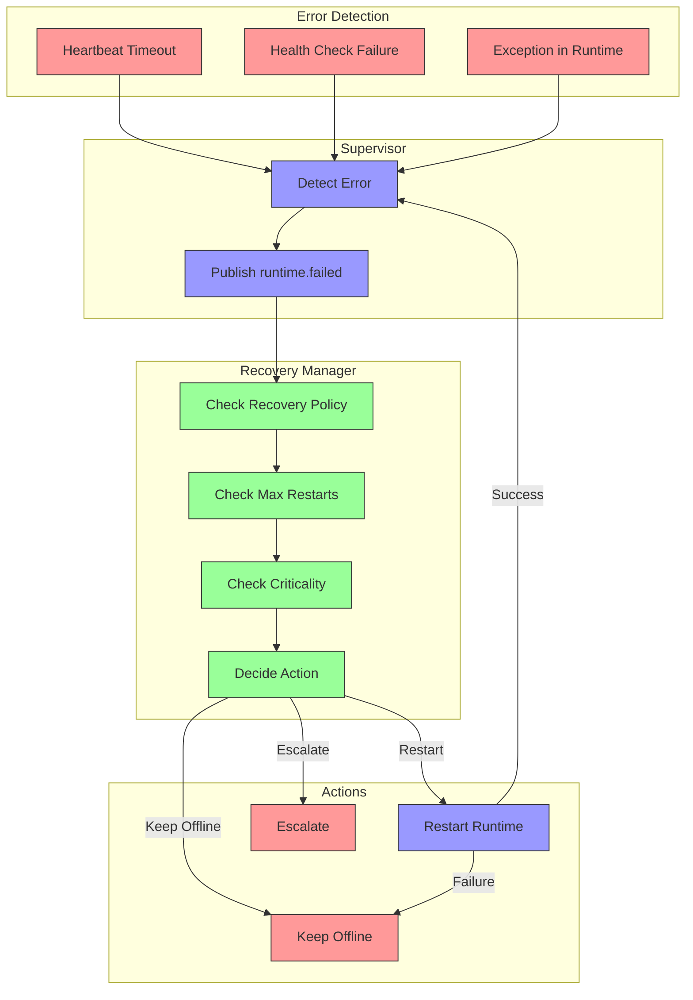
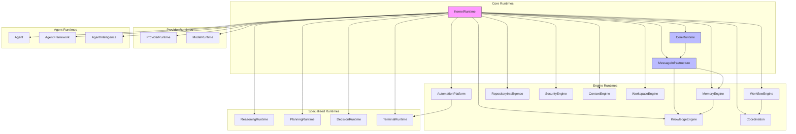
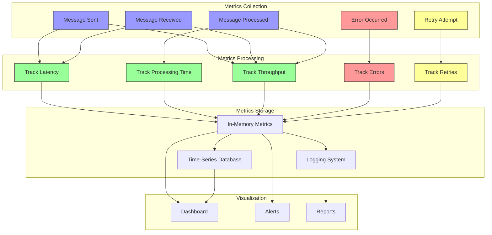
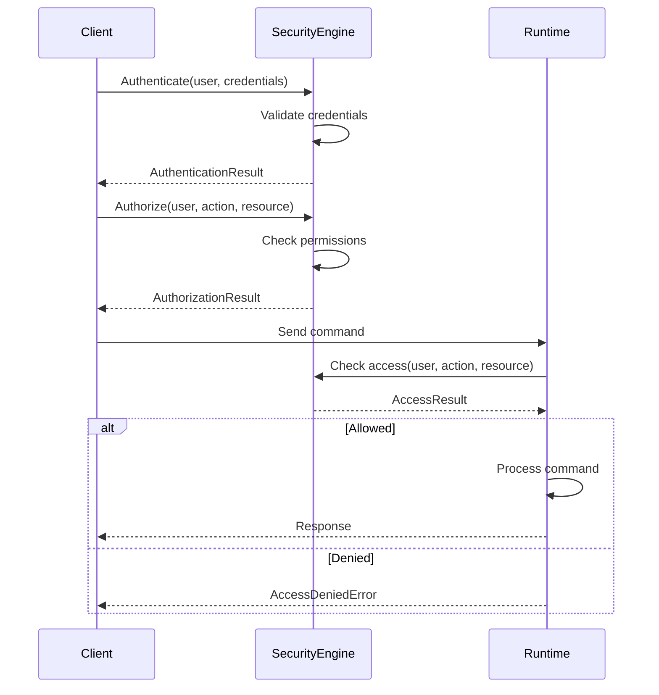
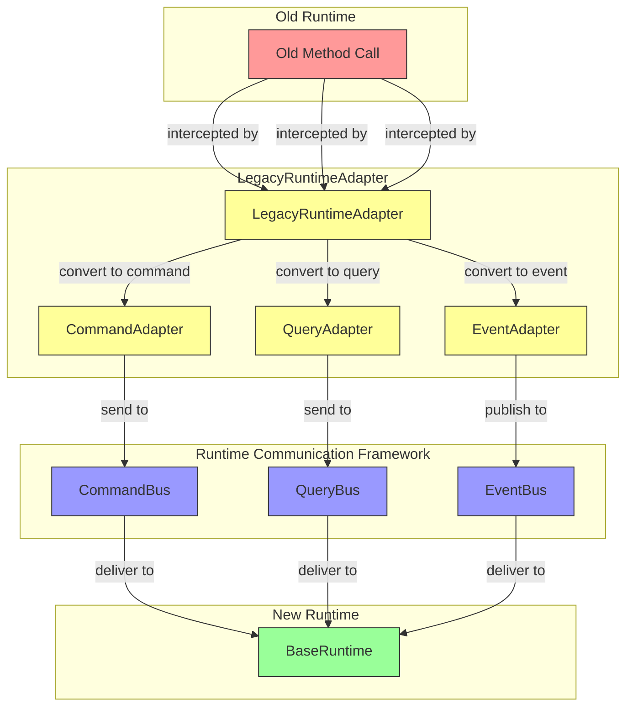

# 📊 TangkuAgentOS Runtime Communication Flow Diagrams

This document contains Mermaid diagrams illustrating the communication flow in TangkuAgentOS.

---

## 🏗️ **1. Overall System Architecture**



---

## 📬 **2. Message Flow: Old vs New**

### **Old Communication (DEPRECATED)**



### **New Communication (REQUIRED)**



---

## 🔄 **3. Runtime Lifecycle**

```mermaid
graph TD
    subgraph Lifecycle["Runtime Lifecycle"]
        UN[UNINITIALIZED]
        INI[INITIALIZING]
        INIT[INITIALIZED]
        STA[STARTING]
        RUN[RUNNING]
        PAU[PAUSED]
        STO[STOPPING]
        STOP[STOPPED]
        FAI[FAILED]
        RES[RESTARTING]
    end

    UN -->|initialize()| INI
    INI -->|_initialize()| INIT
    INIT -->|start()| STA
    STA -->|_start()| RUN
    RUN -->|pause()| PAU
    PAU -->|resume()| RUN
    RUN -->|stop()| STO
    STO -->|start()| STA
    RUN -->|restart()| RES
    RES -->|stop()| STO
    RES -->|start()| STA

    INI -->|error| FAI
    STA -->|error| FAI
    RUN -->|error| FAI
    PAU -->|error| FAI
    STO -->|error| FAI

    style UN fill:#fff,stroke:#333
    style INI fill:#ff9,stroke:#333
    style INIT fill:#9f9,stroke:#333
    style STA fill:#ff9,stroke:#333
    style RUN fill:#9f9,stroke:#333
    style PAU fill:#ff9,stroke:#333
    style STO fill:#ff9,stroke:#333
    style STOP fill:#fff,stroke:#333
    style FAI fill:#f99,stroke:#333
    style RES fill:#ff9,stroke:#333
```

---

## 🎯 **4. Command Flow**

```mermaid
sequenceDiagram
    participant RuntimeA
    participant CommandBus
    participant RuntimeRegistry
    participant RuntimeB

    RuntimeA->>CommandBus: send_command(
        target="RuntimeB",
        type="SaveData",
        payload={...}
    )
    
    CommandBus->>RuntimeRegistry: lookup("RuntimeB")
    RuntimeRegistry-->>CommandBus: RuntimeInfo
    
    CommandBus->>RuntimeB: deliver_command(
        sender="RuntimeA",
        type="SaveData",
        payload={...}
    )
    
    RuntimeB->>RuntimeB: handle_command(command)
    RuntimeB->>RuntimeB: Process command
    
    RuntimeB-->>CommandBus: Response
    CommandBus-->>RuntimeA: Return response
```

---

## 📡 **5. Event Flow**

```mermaid
sequenceDiagram
    participant RuntimeA
    participant EventBus
    participant RuntimeB
    participant RuntimeC

    RuntimeA->>EventBus: publish_event(
        type="memory.updated",
        payload={...}
    )
    
    EventBus->>RuntimeB: deliver_event(
        sender="RuntimeA",
        type="memory.updated",
        payload={...}
    )
    
    EventBus->>RuntimeC: deliver_event(
        sender="RuntimeA",
        type="memory.updated",
        payload={...}
    )
    
    RuntimeB->>RuntimeB: handle_event(event)
    RuntimeC->>RuntimeC: handle_event(event)
```

---

## 🔍 **6. Query Flow**

```mermaid
sequenceDiagram
    participant RuntimeA
    participant QueryBus
    participant RuntimeRegistry
    participant RuntimeB

    RuntimeA->>QueryBus: ask(
        target="RuntimeB",
        type="GetMemory",
        payload={...}
    )
    
    QueryBus->>RuntimeRegistry: lookup("RuntimeB")
    RuntimeRegistry-->>QueryBus: RuntimeInfo
    
    QueryBus->>RuntimeB: deliver_query(
        sender="RuntimeA",
        type="GetMemory",
        payload={...}
    )
    
    RuntimeB->>RuntimeB: handle_query(query)
    RuntimeB->>RuntimeB: Process query
    
    RuntimeB-->>QueryBus: Response
    QueryBus-->>RuntimeA: Return response
```

---

## 🌐 **7. System Startup Sequence**

```mermaid
gantt
    title System Startup Sequence
    dateFormat  X
    section Kernel
    Initialize Framework   :a1, 0, 1
    Create Buses           :a2, after a1, 1
    Create Services        :a3, after a2, 1
    Create Integration Reg :a4, after a3, 1
    
    section Runtimes
    Register Runtime 1     :b1, after a4, 1
    Initialize Runtime 1   :b2, after b1, 1
    Start Runtime 1        :b3, after b2, 1
    
    Register Runtime 2     :b4, after b1, 1
    Initialize Runtime 2   :b5, after b4, 1
    Start Runtime 2        :b6, after b5, 1
    
    Register Runtime N     :b7, after b1, 1
    Initialize Runtime N   :b8, after b7, 1
    Start Runtime N        :b9, after b8, 1
    
    section System
    Publish kernel.started  :c1, after a4, 1
    Publish kernel.ready    :c2, after b9, 1
```



---

## 🛑 **8. Error Recovery Flow**



---

## 📊 **9. Communication Matrix**

```mermaid
quadrantChart
    title Communication Patterns
    x-axis Direct --> Indirect
    y-axis Synchronous --> Asynchronous
    
    quadrant-1 "Synchronous Direct"
        MessageBus: [0.8, 0.2]
        RequestResponseBus: [0.9, 0.3]
    
    quadrant-2 "Asynchronous Direct"
        CommandBus: [0.7, 0.8]
        QueryBus: [0.6, 0.7]
    
    quadrant-3 "Asynchronous Indirect"
        EventBus: [0.2, 0.9]
        BroadcastBus: [0.3, 0.8]
    
    quadrant-4 "Synchronous Indirect"
        : [0.1, 0.1]
```

---

## 🔗 **10. Runtime Dependencies**



---

## 📈 **11. Performance Metrics Flow**



---

## 🔐 **12. Security Flow**



---

## 📝 **13. Backward Compatibility Flow**



---

## 🎉 **Summary**

These diagrams illustrate:

1. **Overall System Architecture** - How all components fit together
2. **Old vs New Communication** - The transition from direct calls to bus-based communication
3. **Runtime Lifecycle** - The states a runtime goes through
4. **Command Flow** - How commands are routed and processed
5. **Event Flow** - How events are published and delivered
6. **Query Flow** - How queries are asked and answered
7. **System Startup Sequence** - The order of operations during startup
8. **Error Recovery Flow** - How errors are detected and recovered from
9. **Communication Matrix** - Different communication patterns
10. **Runtime Dependencies** - How runtimes depend on each other
11. **Performance Metrics Flow** - How metrics are collected and processed
12. **Security Flow** - How authentication and authorization work
13. **Backward Compatibility Flow** - How old runtimes work with the new framework

All diagrams use Mermaid syntax and can be rendered in any Mermaid-compatible viewer.

---

*Generated on: July 9, 2026*
*Part of: TangkuAgentOS Runtime Communication Framework*
